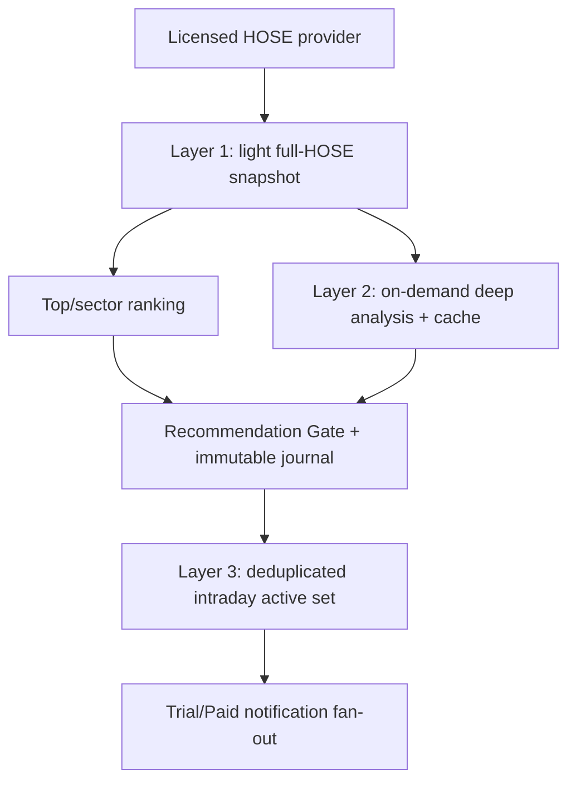

# StockRadar V2.1.2 Architecture

Only the boxed local components from snapshot contract onward are implemented in this V1. The data provider and external notification worker are interfaces/blockers.

## Components

- `engine/stockradar/models.py` — typed recommendation/review/benchmark data model.
- `ticker_lookup.py` — security-master validation, autocomplete, per-horizon SQLite cache and on-demand interface.
- `personalization.py` — tier/email entitlement, onboarding preferences and watchlist limits.
- `monitoring.py` — ticker-level subscriber dedupe and active intraday-universe union.
- `today_changes.py` — significant-event filter for the 30–60 second diff view.
- `scoring.py` — four horizon weight profiles, Coverage range, double-count rejection.
- `state_machine.py` — allowed transitions and deterministic state derivation.
- `ranking.py` — current five-item validation gate and Radar output; production migration must parameterize Top 10 by horizon.
- `ledger.py` + `track-record/schema.sql` — append-only SQLite history.
- `engine/schemas/recommendation-record.schema.json` — immutable recommendation exchange contract.
- `website/server.py` — static pages plus local-only lead/event/ticker API and configurable reference rate limiter.
- `website/public/data/*.json` — generated public demo payload.
- `.github/workflows/pages.yml` — test/build/deploy pipeline for the static GitHub Pages client.

GitHub Pages never executes `website/server.py`. Its deployment artifact sets the client API mode to disabled; a separate HTTPS service is required before lead or event collection.

## Public product surfaces

- `/radar5/` — truthful five-record MOCK shortlist used to exercise legacy ranking gates.
- `/nganh/` — sector × horizon matrix; blocked until taxonomy and full-universe data pass.
- `/kiem-tra-co-phieu/`, `/phan-tich/` and `/co-phieu/?ticker=...` — autocomplete, dynamic route, quick/partial result and four-horizon/holding contract.
- `/thay-doi-hom-nay/` — significant event diff; not a newsfeed.
- `/khuyen-nghi/` — immutable active-recommendation table from the generated demo payload.
- `/email/` — verified Trial/Paid-only personalized email and official scan windows; Free product email is forbidden.
- `/theo-doi/` and `/tai-khoan/` — watchlist, authentication and 30-day subscription contracts; all writes blocked on Pages.
- `/kien-thuc/quy-trinh-stockradar/` — the shared decision workflow used by the engine and GPT explanation layer.

## Production interfaces

Data adapter must provide:

- session calendar;
- HOSE security master;
- OHLCV/intraday bars with timestamps and adjustment basis;
- corporate actions;
- liquidity/RS/market breadth inputs;
- fundamentals/valuation/event timestamps;
- provenance and conflict markers.

Alert worker must provide idempotent events with operation ID, snapshot ID, ticker, from/to state, priority, delivery status and retry evidence.

## Knowledge surface

`website/kien-thuc/` is static, source-attributed product education. It has no data-write path and cannot change engine decisions. Every article explains method mechanics, StockRadar usage, failure modes and reading sources. Client analytics records only hub/method views through the existing allowlisted event path.

## Failure policy

- Feed unavailable/stale/conflicted → Research Grade or lower.
- Full-universe or horizon gate fail → no Top 10 HOSE label.
- Important gate UNKNOWN → no action claim.
- Duplicate snapshot → reject.
- Correction → append, never update/delete original.
- Missing/stale deep report → return quick/partial result; never fabricate or return ticker 404 solely for cache absence.
- Pages fixture is not a full current HOSE master → lookup demo may PASS while “any current HOSE ticker” remains BLOCKED.
- Anonymous request flood → production rate limiter must fail closed; client-only limits are not security controls.
