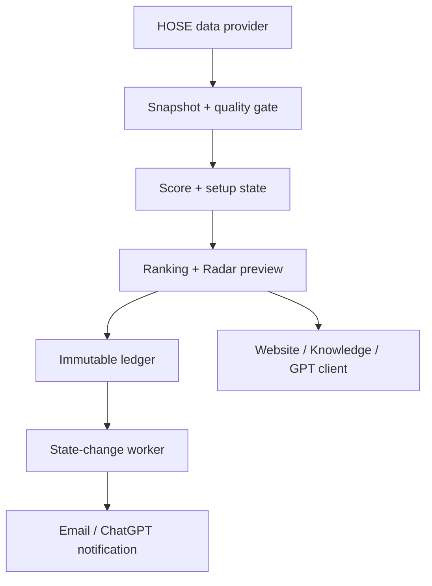

# StockRadar V1 Architecture

Only the boxed local components from snapshot contract onward are implemented in this V1. The data provider and external notification worker are interfaces/blockers.

## Components

- `engine/stockradar/models.py` — typed data model.
- `scoring.py` — fixed buckets, Coverage range, double-count rejection.
- `state_machine.py` — allowed transitions and deterministic state derivation.
- `ranking.py` — current five-item validation gate and Radar output; production migration must parameterize Top 10 by horizon.
- `ledger.py` + `track-record/schema.sql` — append-only SQLite history.
- `website/server.py` — static pages plus local-only lead/event API.
- `website/public/data/*.json` — generated public demo payload.
- `.github/workflows/pages.yml` — test/build/deploy pipeline for the static GitHub Pages client.

GitHub Pages never executes `website/server.py`. Its deployment artifact sets the client API mode to disabled; a separate HTTPS service is required before lead or event collection.

## Production interfaces

Data adapter must provide:

- session calendar;
- HOSE security master;
- OHLCV/intraday bars with timestamps and adjustment basis;
- corporate actions;
- liquidity/RS/market breadth inputs;
- fundamentals/valuation/event timestamps;
- provenance and conflict markers.

Alert worker must provide idempotent events with operation ID, snapshot ID, ticker, from/to state, priority, delivery status and retry evidence.

## Knowledge surface

`website/kien-thuc/` is static, source-attributed product education. It has no data-write path and cannot change engine decisions. Every article explains method mechanics, StockRadar usage, failure modes and reading sources. Client analytics records only hub/method views through the existing allowlisted event path.

## Failure policy

- Feed unavailable/stale/conflicted → Research Grade or lower.
- Full-universe or horizon gate fail → no Top 10 HOSE label.
- Important gate UNKNOWN → no action claim.
- Duplicate snapshot → reject.
- Correction → append, never update/delete original.
